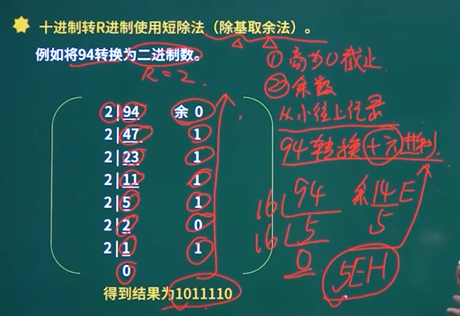

# 软考知识

## 计算机组成与体系结构

### 进制转换

- R进制转十进制，使用**按权展开法**，例如10110.01(二进制 B)
  $$
  (1*2^4)+(1*2^2)+(1*2^-2) = 20.25
  $$

- 十进制转R进制，**短除法（除基取余法）** 

  - 商为0为止
  - 余数从下往上记录
  - 

  

- 二进制转八进制与十六进制 

### 码制（原码/反码/补码/移码）

- 源码：最高位是符号位，其余低位表示数值的绝对值

  - 例如：+7：0111   -7：1111

- 反码：正数的反码与原码相同，负数的原码是其绝对值按位取反（符号位不变）

- 补码：正数的补码与原码相同，负数的补码是其反码末位加1（符号位不变）

- 移码：补码的符号位按位取反

  |      | 数值1     | 数值-1    | 1+(-1)    |
  | ---- | --------- | --------- | --------- |
  | 源码 | 0000 0001 | 1000 0001 | 1000 0010 |
  | 反码 | 0000 0001 | 1111 1110 | 1111 1111 |
  | 补码 | 0000 0001 | 1111 1111 | 0000 0000 |
  | 移码 | 1000 0001 | 0111 1111 | 1000 0000 |

  使用补码进行加减运算才是正确的
  
  

## 数据库系统

### 数据库体系结构

#### 集中式数据库系统

- 数据是集中的
- 数据管理是集中的
- 数据库系统的所有功能（从形式的用户接口到DBMS核心）都集中在DBMS所在的计算机

#### C/S结构

- 客户端负责数据表示服务
- 服务器主要负责数据库服务
- 数据库系统分为前端和后端
- ODBC、JDBC

#### 分布式数据库

- 物理上分布、逻辑上集中
- 物理上分布、逻辑上分布
- 特点
  - **数据独立性**。处理数据的逻辑独立性与物理独立性外，还有数据分布独立性（分布透明性）
  - **集中与自治共享结合的控制结构**。各局部的DBMS可以独立地管理局部数据库，具有自治的功能。同时，系统又设有集中控制机制，协调各局部DBMS的工作，执行全局应用。
  - **适当增加数据冗余度**。在不同的场地存储同一数据的多个副本，可以提高**系统的可靠性和可用性**，同时也能提高系统性能。
    - **提高系统的可用性**，即当系统中某个节点发生故障时，因为数据有其他副本在非故障场地中，对其他所有场地来说，数据仍然是可用的，从而保证数据的完备性。
  - 全局的一致性、可串行性和可恢复性
  - 例题：
    - 
- 透明性
  - **分片透明**：是指用户不必关心数据是如何分片(分块)的，他们对数据的操作在全局关系上进行，即如何分片对用户是透明的
  - **复制透明**：用户不用关心数据库在网络中各个节点的复制情况，被复制的数据的更新都由系统自动完成
  - **位置透明**：是指用户不必知道所有操作的数据放在何处，即数据分配到哪个或哪些站点存储对用户是透明的
  - **局部映像透明性（逻辑透明）**：是最低层次的透明性，该透明性提供数据到局部数据库的映像，即用户不必关心局部DBMS支持哪种数据模型、使用哪种数据操纵语言，数据模型和操纵语言是由系统完成的。因此，局部映像透明性对异构型和同构异质的分布式数据库系统是非常重要的。
  - 例题：
    - 

#### 并行数据库

- 共享内存式
- 无共享式

### 数据库的基本概念

#### 三级模式和两级映像

 
